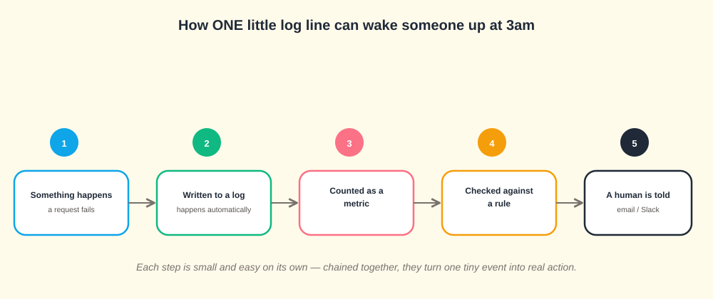
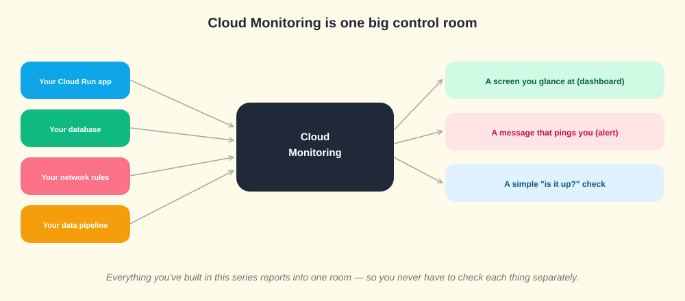
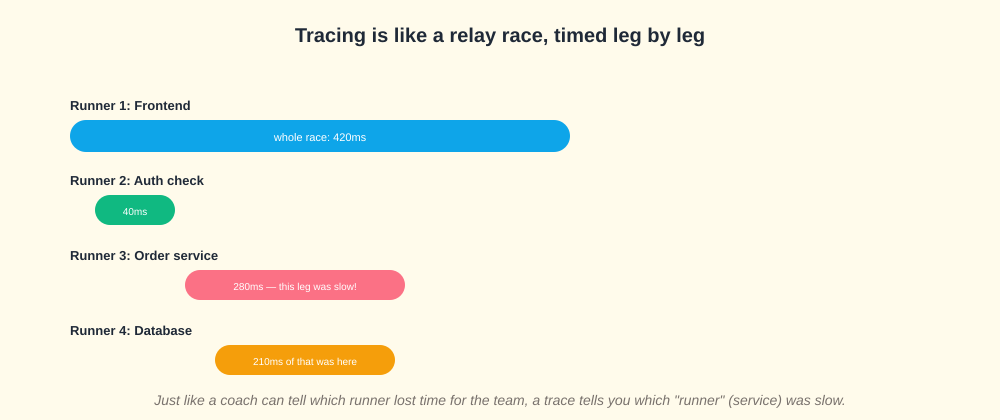
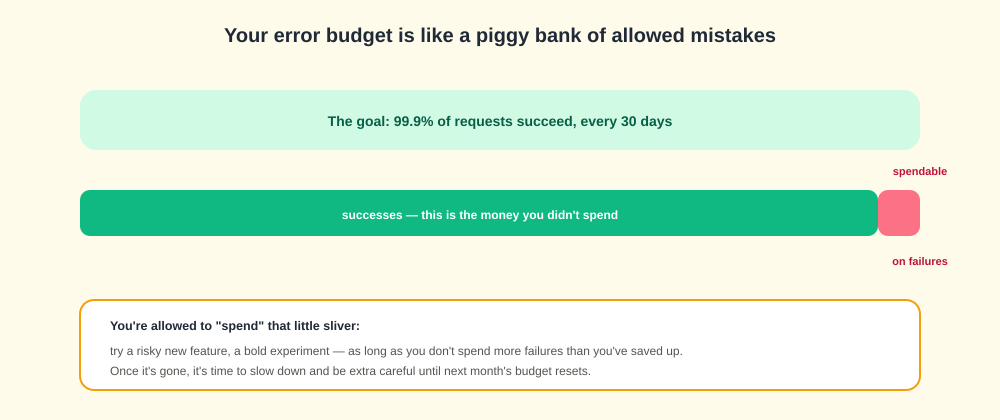
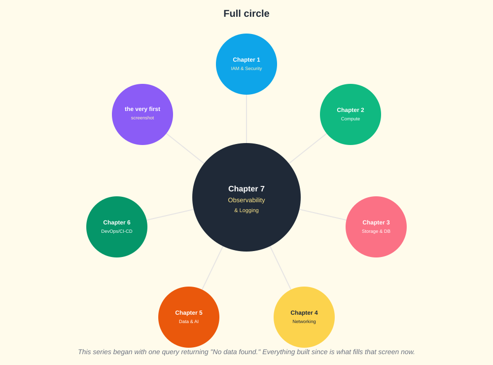

# 🌅 GCP Observability, Explained From Zero
### Chapter 7 of a learning series — the finale, written for someone who has never seen this before

> *"This whole series started with a screen saying 'No data found.' By the end of this page, you'll understand exactly what that screen is, and why it matters."*

---

## 👋 Before We Start

You don't need to know anything about cloud computing to read this. Every single term is explained the moment it's used — nothing is assumed. If a word feels technical, keep reading one more sentence; it gets defined right there.

This page tells one continuous story, in order. Each part builds on the one before it. Don't skip ahead — the whole point is that idea #4 makes much more sense once you understand idea #3.

---

## 📖 Table of Contents
1. [Lesson 1 — Why does a computer program need "watching" at all?](#lesson-1--why-does-a-computer-program-need-watching-at-all)
2. [Lesson 2 — Logging: the diary](#lesson-2--logging-the-diary)
3. [Lesson 3 — From a diary entry to someone getting woken up at 3am](#lesson-3--from-a-diary-entry-to-someone-getting-woken-up-at-3am)
4. [Lesson 4 — Monitoring: the control room](#lesson-4--monitoring-the-control-room)
5. [Lesson 5 — Tracing: the relay race](#lesson-5--tracing-the-relay-race)
6. [Lesson 6 — Error Reporting: grouping the same complaint](#lesson-6--error-reporting-grouping-the-same-complaint)
7. [Lesson 7 — SLOs: how good is "good enough"?](#lesson-7--slos-how-good-is-good-enough)
8. [Lesson 8 — Full Circle: what this whole series actually built](#lesson-8--full-circle-what-this-whole-series-actually-built)
9. [Quick-Reference Glossary](#-quick-reference-glossary)
10. [Test Yourself](#-test-yourself)
11. [What's Next](#-whats-next)

---

## Lesson 1 — Why does a computer program need "watching" at all?

Imagine you open a small shop. On day one, you can see everything yourself — you're standing right there. You know if a customer is happy, if the till is working, if the shelves are full.

Now imagine your shop grows into 50 shops, in 50 cities, open 24 hours a day. You physically cannot stand in all of them at once. But you still need to know: **is everything okay? If something breaks, which shop, and what broke?**

A running computer program — like the Cloud Run service you may have built in Chapter 2 of this series — has exactly this same problem, except worse: it might be answering thousands of requests every minute, and nobody is "standing there" watching it happen.

**Observability** is just the general name for "the tools that let you know what's going on inside something you can't directly see or stand inside of." That's genuinely the whole idea. Everything else in this page is just different flavors of that one need.

---

## Lesson 2 — Logging: the diary

The simplest possible answer to "what's going on in there?" is: **write down everything that happens, as it happens.**

That's a **log**. Every time something happens inside your program — a request comes in, a file gets saved, something goes wrong — a line of text gets written down describing it, with a timestamp. Stack enough of these lines together and you have a complete diary of your program's life.

**This is exactly where this whole learning series began.** The very first thing looked at, all the way back in Chapter 1, was a screen called the **Logs Explorer** — literally a search box for reading this diary. It said "No data found" because, at that point, nothing had happened yet worth writing down. Every chapter since then — creating accounts, deploying a service, connecting a database — has been quietly adding new diary entries.

**A small but important detail: not every diary entry is equally important.** Programs label each entry with a **severity**, from calm to urgent:

`DEBUG` (barely worth mentioning) → `INFO` (routine) → `WARNING` (something recoverable went a bit wrong) → `ERROR` (something failed) → `CRITICAL` (the whole thing is broken)

This matters because during a real problem, you don't want to read 10,000 routine diary entries to find the 3 that matter — you filter straight to `ERROR` and above.

---

## Lesson 3 — From a diary entry to someone getting woken up at 3am

A diary is only useful if someone reads it. But nobody wants to sit refreshing a log screen all day, every day, forever. So there's a chain of small steps that turns "one diary entry" into "a person gets a message on their phone."

Walking through it in plain words:

1. **Something happens** — say, a request to your app fails.
2. **It gets written to the diary (log)** automatically — you don't have to do anything for this part.
3. **It gets counted.** Instead of reading every single diary line, a computer counts *how many* "failure" lines show up — this count is called a **metric**. A metric is just a number that changes over time, like a car's speedometer.
4. **The count gets checked against a rule** — for example, "if more than 10 failures happen in 5 minutes, that's not normal."
5. **If the rule is broken, a human is told** — an email, a Slack message, or in serious cases, a phone alert.

**Why this matters:** nobody designed this chain to be complicated for its own sake. Each step solves a real, specific problem: step 3 exists because reading raw diary lines doesn't scale; step 4 exists because a human can't watch a number 24/7; step 5 exists because the whole point is that a *person*, not just a computer, needs to know when something is genuinely wrong.

---

## Lesson 4 — Monitoring: the control room

If logging is "a detailed diary," **monitoring** is "a control room with dashboards" — like the dashboard in a car showing speed, fuel, and engine temperature all at once, without you having to read the car's entire maintenance history to know if something's wrong right now.

Every single thing built earlier in this series — a Cloud Run app, a database, network rules, a data pipeline — reports its health into this one shared control room. From there, you get three useful things:

- **A screen you glance at (a dashboard)** — numbers and graphs, updated live.
- **A message that pings you (an alert)** — exactly the chain from Lesson 3, now visualized.
- **A simple "is it even up?" check (an uptime check)** — imagine someone standing outside your shop every minute, just checking the door isn't locked. This catches the worst-case scenario: your program is so broken it can't even write to its own diary.

---

## Lesson 5 — Tracing: the relay race

Here's a problem logging and monitoring alone don't fully solve: imagine a request to your website has to pass through **four different services** before it's done — like a relay race with four runners passing a baton. If the whole race takes 420 milliseconds (a fraction of a second), which runner was slow?

**Tracing** answers exactly this. Every service that touches a request adds its own timed "leg" to a shared record, called a **trace**. Looking at the finished trace, you can see: the auth check took 40ms, the database query took 210ms, and so on — instantly showing you which leg of the race actually ate up the time, instead of you guessing.

---

## Lesson 6 — Error Reporting: grouping the same complaint

Picture a customer service inbox that receives 500 emails overnight, and 480 of them are the exact same complaint, just worded slightly differently each time. Reading all 480 one by one would be a huge waste of time — what you actually want is: "this ONE issue happened 480 times last night."

**Error Reporting** does exactly this for your program's errors: it automatically groups nearly-identical errors together (based on what part of the code caused them), so instead of scrolling through thousands of error log lines, you see a short list like "Bug A: happened 480 times, Bug B: happened 3 times" — telling you instantly what to fix first.

---

## Lesson 7 — SLOs: how good is "good enough"?

Here's a question every real system has to answer honestly: **does it need to work perfectly, 100% of the time, forever?** For almost everything in the real world, the answer is no — that would be extremely expensive and often impossible. Instead, teams pick an honest, specific target, called an **SLO (Service Level Objective)** — something like "99.9% of requests should succeed, measured over 30 days."

That leftover 0.1% isn't just "acceptable failure" — it's treated like **a piggy bank you're allowed to spend**, called an **error budget**. You can "spend" it on calculated risks: trying a bold new feature, a risky migration. As long as you don't overspend it, you're still meeting your promise. Once it's empty, that's a clear, built-in signal: stop taking risks for a while, and focus on stability until the budget refills next month.

---

## Lesson 8 — Full Circle: what this whole series actually built

Now here's the payoff for reading all the way through. Look back at that very first "No data found" screen from the start of this series. Here's what was actually missing from it, chapter by chapter:

- **Chapter 1** hadn't created any identities yet — so there was nothing to log *about*.
- **Chapter 2** hadn't deployed anything — so there was no running service generating activity.
- **Chapter 3** hadn't connected a database — so there were no data-access events to record.
- **Chapter 4** hadn't set up any network rules — so there was nothing to allow or block yet.
- **Chapter 5** hadn't built a data pipeline — so there were no events flowing anywhere.
- **Chapter 6** hadn't automated any deployments — so there was no build history to speak of.

**Every single chapter was, without saying so directly, generating the raw material this chapter is built to make sense of.** The "No data found" screen wasn't broken — it was accurately reporting that nothing had happened yet. Now you know exactly what would need to happen to fill it, and exactly what tools exist to read, summarize, and act on it once it does.

---

## 📘 Quick-Reference Glossary

| Term | Plain-English meaning |
|---|---|
| **Log** | A diary entry — a record of one thing that happened, with a timestamp |
| **Severity** | How urgent a log entry is, from DEBUG (routine) to CRITICAL (everything's broken) |
| **Metric** | A number that changes over time, like a speedometer reading |
| **Alert** | A rule that watches a metric and notifies a human when it's crossed |
| **Dashboard** | A screen showing several metrics at a glance |
| **Uptime check** | A simple "is it even reachable?" test, run from outside your system |
| **Trace / Span** | A trace is the full timeline of one request; a span is one timed leg within it |
| **SLO** | A specific, honest target for how reliable a system should be |
| **Error budget** | The small amount of allowed failure under an SLO, treated as spendable |

---

## 🧠 Test Yourself

Try answering these out loud, in your own words, before checking back against the lessons above:

1. Using the shop analogy, explain why a program running at scale needs observability tools at all.
2. What's the difference between a log entry and a metric?
3. Walk through, step by step, how one failed request could end up as a Slack message.
4. Using the relay race analogy, explain what a "span" is.
5. Why is an error budget described as something you can "spend," rather than just a limit you must never touch?
6. Explain, in one sentence per chapter, what Chapters 1–6 each contributed to the original "No data found" screen finally having something to show.

---

## 🔭 What's Next

This is the last chapter in the series — but the natural next step is putting it into practice: taking the Cloud Run service from Chapter 2, adding a log-based metric for its errors, and setting up a real alert, closing the loop between theory and something you can actually watch happen live.

---

*The complete series — Chapter 1: [gcp-iam-least-privilege-lab](../gcp-iam-least-privilege-lab) · Chapter 2: [gcp-compute-least-privilege-lab](../gcp-compute-least-privilege-lab) · Chapter 3: [gcp-firestore-least-privilege-lab](../gcp-firestore-least-privilege-lab) · Chapter 4: [gcp-networking-deep-dive](../gcp-networking-deep-dive) · Chapter 5: [gcp-data-ai-deep-dive](../gcp-data-ai-deep-dive) · Chapter 6: [gcp-devops-cicd-deep-dive](../gcp-devops-cicd-deep-dive) · Chapter 7: this repo*
